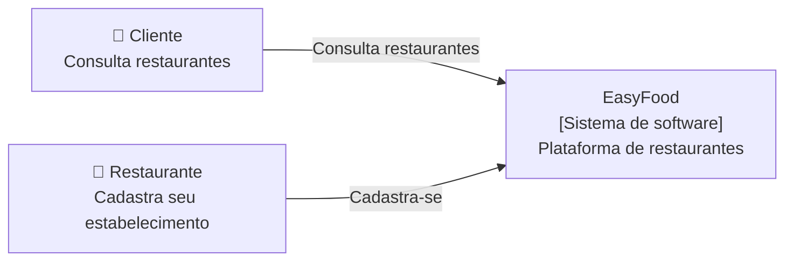
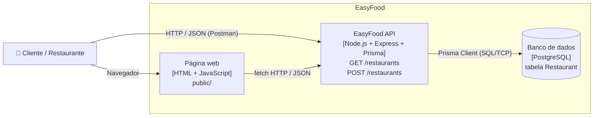
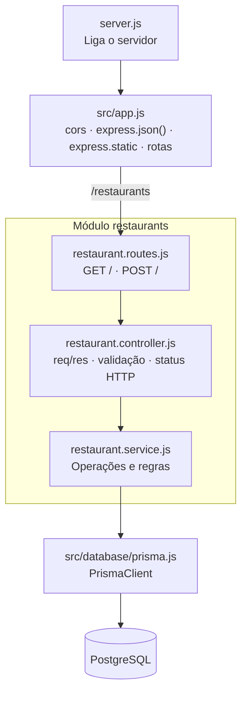

# Arquitetura da EasyFood — C4 Model

Cada nível é um *zoom* maior no sistema: Context → Container → Component → Code.

## Nível 1 — Context

Quem usa o sistema e com quem ele se relaciona?



## Nível 2 — Container

Quais aplicações e armazenamentos formam o sistema?



> Mudança em relação à versão anterior: o container "array em memória" foi substituído pelo
> PostgreSQL ([ADR-002](../adr/ADR-002-persistencia-com-postgresql.md)).

## Nível 3 — Component

Como a API está organizada internamente? Monólito modular em camadas
([ADR-003](../adr/ADR-003-monolito-modular-em-camadas.md)).



## Nível 4 — Code

```js
// restaurant.routes.js
router.get("/", controller.list);
router.post("/", controller.create);

// restaurant.controller.js
async function create(req, res) {
  const { name, category, rating } = req.body || {};
  const validationError = validateRestaurant({ name, category, rating });
  if (validationError) return res.status(400).json({ error: validationError });
  const restaurant = await restaurantService.createRestaurant({ name, category, rating });
  res.status(201).json(restaurant);
}

// restaurant.service.js
async function createRestaurant(data) {
  const restaurant = await prisma.restaurant.create({
    data: { name: data.name, category: data.category, rating: data.rating || 0 }
  });
  return formatRestaurant(restaurant);
}
```
