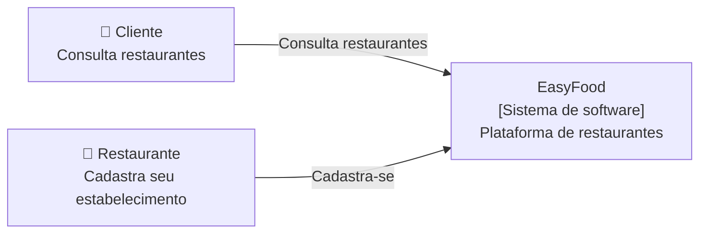
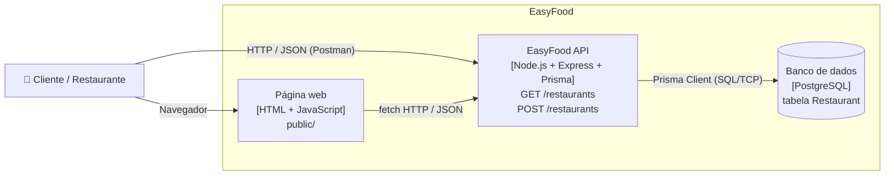
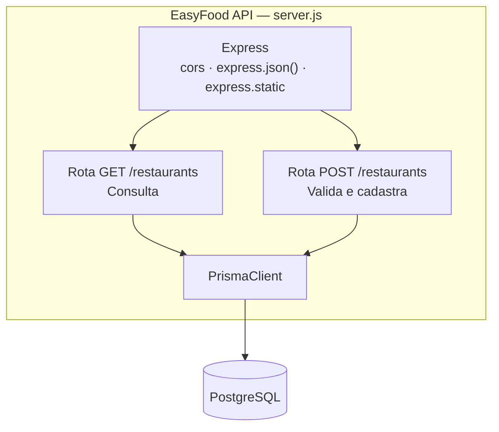

# Arquitetura da EasyFood — C4 Model

Cada nível é um *zoom* maior no sistema: Context → Container → Component → Code.

## Nível 1 — Context

Quem usa o sistema e com quem ele se relaciona?



## Nível 2 — Container

Quais aplicações e armazenamentos formam o sistema?



> Mudança em relação à versão anterior: o container "array em memória" foi substituído pelo
> PostgreSQL ([ADR-002](../adr/ADR-002-persistencia-com-postgresql.md)).

## Nível 3 — Component

Como a API está organizada internamente?



## Nível 4 — Code

```js
app.post("/restaurants", async (req, res) => {
  const { name, category, rating } = req.body || {};
  // validações -> 400
  try {
    const novoRestaurante = await prisma.restaurant.create({
      data: { name, category, rating: rating || 0 }
    });
    res.status(201).json(formatRestaurant(novoRestaurante));
  } catch (error) {
    res.status(500).json({ error: "Erro interno do servidor" });
  }
});
```
