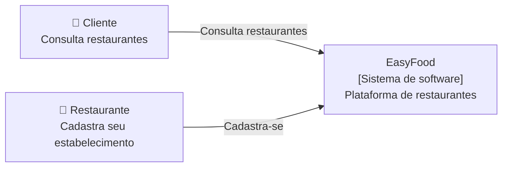
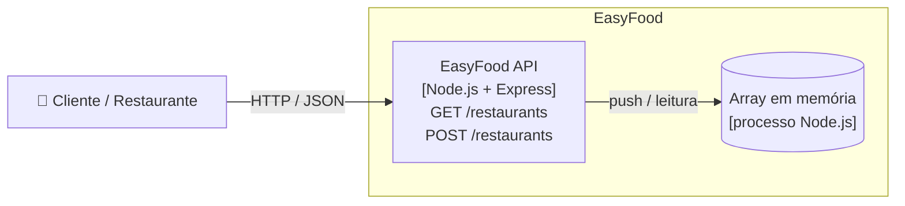
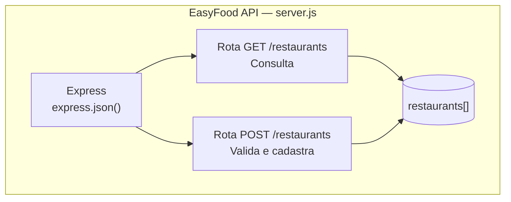

# Arquitetura da EasyFood — C4 Model

Cada nível é um *zoom* maior no sistema: Context → Container → Component → Code.

## Nível 1 — Context

Quem usa o sistema e com quem ele se relaciona?



## Nível 2 — Container

Quais aplicações e armazenamentos formam o sistema?



## Nível 3 — Component

Como a API está organizada internamente?



## Nível 4 — Code

```js
app.post("/restaurants", (req, res) => {
  const { name, category, rating } = req.body || {};
  // validações -> 400
  const novoRestaurante = { id: restaurants.length + 1, name, category, rating: rating || 0 };
  restaurants.push(novoRestaurante);
  res.status(201).json(novoRestaurante);
});
```
