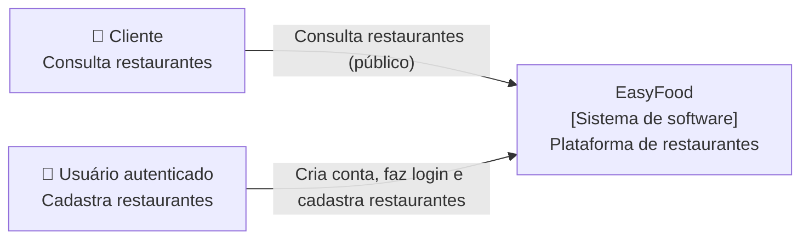
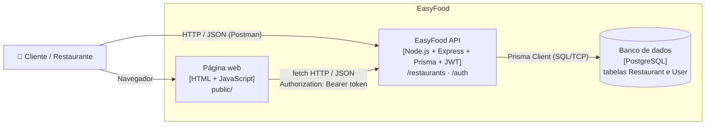
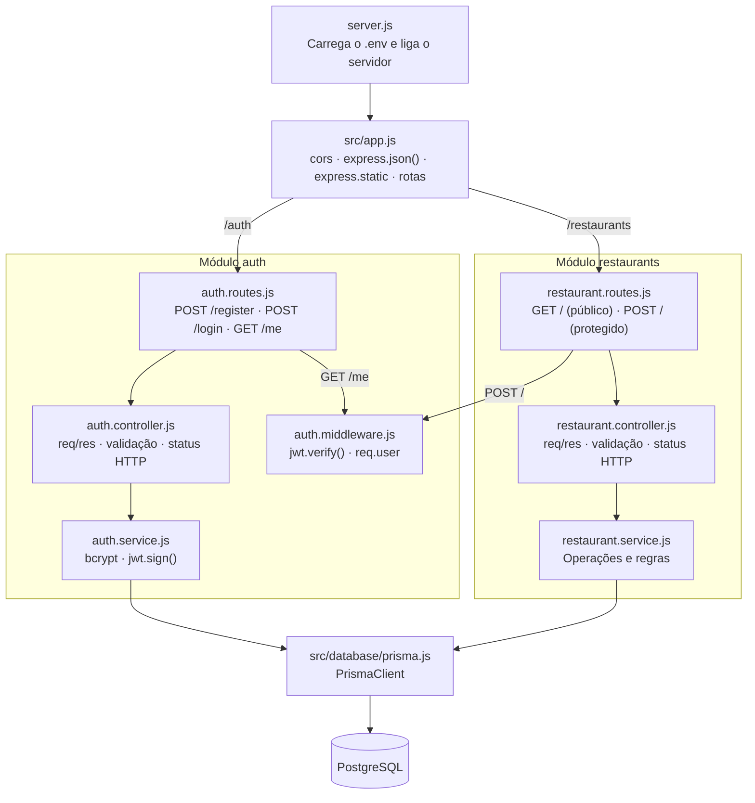

# Arquitetura da EasyFood — C4 Model

Cada nível é um *zoom* maior no sistema: Context → Container → Component → Code.

## Nível 1 — Context

Quem usa o sistema e com quem ele se relaciona?



## Nível 2 — Container

Quais aplicações e armazenamentos formam o sistema?



> Mudança em relação à versão anterior: o container "array em memória" foi substituído pelo
> PostgreSQL ([ADR-002](../adr/ADR-002-persistencia-com-postgresql.md)).

## Nível 3 — Component

Como a API está organizada internamente? Monólito modular em camadas
([ADR-003](../adr/ADR-003-monolito-modular-em-camadas.md)), com autenticação JWT
([ADR-004](../adr/ADR-004-autenticacao-com-jwt.md)).



Fluxo de autenticação:

```
CADASTRO -> senha -> bcrypt -> hash -> PostgreSQL
LOGIN    -> bcrypt.compare() -> JWT
REQUISIÇÃO -> Authorization: Bearer <token> -> MIDDLEWARE -> ROTA PROTEGIDA
```

## Nível 4 — Code

```js
// restaurant.routes.js
router.get("/", controller.list);
router.post("/", authenticate, controller.create);

// auth.middleware.js
function authenticate(req, res, next) {
  const authHeader = req.headers.authorization;
  if (!authHeader || !authHeader.startsWith("Bearer ")) {
    return res.status(401).json({ error: "Token não fornecido" });
  }
  try {
    const payload = jwt.verify(authHeader.split(" ")[1], JWT_SECRET);
    req.user = { id: payload.sub, email: payload.email };
    next();
  } catch (error) {
    return res.status(401).json({ error: "Token inválido ou expirado" });
  }
}
```
